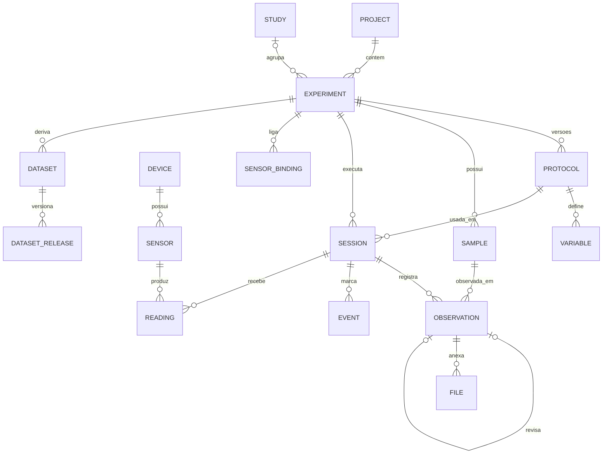

# Arquitetura do EdgeData

## 1. Princípio

> Um dataset científico não é um conjunto de arquivos: é o registro completo da origem de cada
> observação.

Toda observação precisa responder: **qual experimento, qual protocolo (e versão), qual sessão,
qual amostra, quem, quando, onde, com qual dispositivo/sensor/firmware/calibração, e que
transformações sofreu depois**. As decisões abaixo existem para que essas respostas sejam
gravadas no momento da coleta, e não reconstruídas meses depois.

## 2. Modelo de domínio

```
Workspace                       (implícito no modo simples: 1 por aparelho)
└── Project
    ├── Study                   (opcional; agrupa experimentos relacionados)
    └── Experiment
        ├── Design              fatores, tratamentos, controles, réplicas, blocos, sessões previstas
        ├── Protocol v1, v2…    metodologia versionada
        │   └── Variables       o que é medido (tipo, unidade UCUM, faixa, precisão, papel…)
        ├── Samples             unidades experimentais (planta, vaso, parcela, corpo de prova)
        ├── Sessions / Runs     cada ida a campo / corrida de aquisição (registra a versão do protocolo)
        │   ├── Observations    valores medidos para uma amostra (imutáveis, com revisões)
        │   ├── Readings        leituras de dispositivos (séries temporais)
        │   ├── Events          marcadores (“válvula aberta”, “chuva começou”)
        │   └── Files           fotos, áudio, anexos (com SHA-256)
        ├── Sensor bindings     variável ← sensor de um dispositivo
        └── Datasets
            └── Releases        v1.0.0 (congelada), v1.1.0… com manifesto de checksums

Device ── Sensors               (nível do workspace; reutilizados entre experimentos)
AuditLog                        (append-only; base da proveniência)
```

Diferenças deliberadas em relação a um modelo “formulário + respostas”:

- **Dataset ≠ Experimento.** O experimento gera dados; um ou mais datasets são *derivados* deles e
  recebem versões.
- **Variáveis pertencem à versão do protocolo.** Alterar uma variável após existirem dados cria uma
  nova versão do protocolo; sessões antigas continuam apontando para a definição com que foram
  coletadas.
- **Amostras pertencem ao experimento**, não à sessão: a mesma planta é observada em várias sessões.
- **Dispositivos pertencem ao workspace**: o mesmo ESP32 é usado em vários experimentos, e cada
  sessão guarda um *snapshot* da configuração do hardware.

### Entidades universais

Tudo que vem de hardware é descrito por cinco entidades, mapeáveis 1:1 para o OGC SensorThings:

| EdgeData | SensorThings | Exemplo |
|---|---|---|
| Device | Thing | ESP32-S3 “Estação de Solo 01” |
| Sensor | Sensor | DS18B20 #2 |
| Variable (quantidade + unidade) | ObservedProperty | Temperatura do solo, `Cel` |
| Stream (device + sensor + variável) | Datastream | `estacao01/soil_temp@1Hz` |
| Reading / Observation | Observation | `23.4 Cel @ 2026-09-27T14:32:04Z` |
| Sample | FeatureOfInterest | Planta T1_C_F1_R1 |
| Event | — (extensão) | “Irrigação iniciada” |

## 3. Regras invioláveis do núcleo

1. **Dados brutos são imutáveis.** A tabela `observations` não aceita `UPDATE` nos valores nem
   `DELETE` — isso é forçado por *triggers* do SQLite, não por convenção. Uma correção cria uma
   **revisão** (nova linha que aponta para a anterior via `supersedes_id`); uma exclusão é uma
   **retratação** com motivo. O valor original nunca some.
2. **Tudo que muda metadados gera auditoria.** `audit_log` é append-only (também protegido por
   *triggers*) e registra quem, quando, entidade, ação e diferença. É a base da exportação de
   proveniência (W3C PROV).
3. **Valores são guardados na unidade em que foram medidos.** A unidade (código UCUM) fica ao lado;
   conversões acontecem só em análise/exportação.
4. **Dados de má qualidade não são apagados**: recebem *flags* de QC (`GOOD`, `SUSPECT`, `BAD`,
   `MISSING`, `OUT_OF_RANGE`, `SATURATED`, `MANUAL_REVIEW`…).
5. **IDs são UUID gerados no aparelho**, o que torna a sincronização futura uma união de conjuntos.
6. **Tempo é sempre ISO-8601 em UTC** (`2026-09-27T17:32:04.120Z`) mais o fuso do aparelho; leituras
   de dispositivos guardam também o relógio monotônico do dispositivo.

## 4. Camadas do app

```
apps/mobile/
├── app/            Telas (Expo Router)
├── components/     Componentes de UI
├── hooks/          Estado e acesso a dados para as telas
├── database/       SQLite: migrações, repositórios, backup, importação legada
├── devices/        Transportes (BLE) e sessão de dispositivo
├── export/         Escrita do pacote de dataset em disco (usa core/export)
└── core/           Domínio puro em TypeScript — sem React Native
    ├── units       Catálogo UCUM, conversão, compatibilidade dimensional
    ├── variables   Tipos de variável, validação de definição, visibilidade condicional
    ├── validation  Validação de valores
    ├── qc          Flags de qualidade automáticas
    ├── design      Expansão do desenho experimental → plano de amostras
    ├── codes       Formato de QR Code / códigos de amostra
    ├── device      Manifesto de dispositivo e protocolo de mensagens
    └── export      CSV, JSONL, Parquet, README, dicionário de dados, datapackage.json, checksums
```

O `core/` não importa nada de React Native nem do Expo. Isso permite testá-lo com Vitest no Node e,
na V2, reaproveitá-lo no backend e em ferramentas de linha de comando.

## 5. Banco local (SQLite)

- Migrações numeradas e idempotentes, controladas por `PRAGMA user_version`.
- `PRAGMA foreign_keys = ON`, `journal_mode = WAL`.
- Valores dinâmicos (variáveis variam por experimento) ficam em colunas JSON; o que é estrutural
  (IDs, tempo, GPS, sessão, amostra, QC, revisões) fica em colunas próprias e indexadas.



## 6. Dispositivos

- **Protocolo**: mensagens JSON delimitadas por nova linha (NDJSON), iguais em todos os transportes
  (BLE, USB Serial, TCP/WebSocket). Detalhes em [`PROTOCOLO_DISPOSITIVOS.md`](PROTOCOLO_DISPOSITIVOS.md).
- **Manifesto**: o dispositivo se descreve (modelo, firmware, sensores, unidades UCUM, faixas,
  resolução). Schema público em [`../schemas/device-manifest.schema.json`](../schemas/device-manifest.schema.json).
- **Firmware**: biblioteca Arduino/PlatformIO em [`../firmware/edgedata-arduino`](../firmware/edgedata-arduino).
- **Transportes** implementam a mesma interface (`connect`, `send`, `onLine`, `disconnect`); no MVP
  existe BLE. USB Serial, MQTT, LoRaWAN e outros entram como novos transportes (V2).
- **Taxa de dados**: BLE atende leituras periódicas e preview. Aquisição de alta taxa (kS/s por
  canal) grava localmente no embarcado e transfere arquivos por Wi-Fi/USB.

## 7. Exportação (pacote de dataset)

```
<experimento>-v1.0.0/
├── README.md               gerado a partir dos metadados
├── datapackage.json        Frictionless Data Package + Table Schema
├── metadata.json           experimento, desenho, protocolo, equipe, dispositivos
├── data_dictionary.csv     variável, tipo, unidade, descrição, faixa
├── provenance.json         trilha de auditoria (compatível com W3C PROV-JSON)
├── checksums.sha256        SHA-256 de todos os arquivos
├── data/
│   ├── samples.{csv,jsonl,parquet}
│   ├── observations.{csv,jsonl,parquet}
│   ├── readings.{csv,jsonl,parquet}
│   ├── events.{csv,jsonl,parquet}
│   └── sessions.{csv,jsonl,parquet}
└── files/                  fotos e anexos
```

Exportadores são registrados por formato (`core/export/registry`) — novos formatos (HDF5, NetCDF,
RO-Crate, Croissant) entram como novos exportadores sem alterar o restante.

## 8. Evolução (V2/V3)

```
                  ┌──────────────┐
                  │   Web App    │
                  └──────┬───────┘
┌────────────┐    ┌──────▼───────┐     ┌──────────────────────┐
│ Mobile App │────│   Core API   │─────│ PostgreSQL+Timescale │
└─────┬──────┘    │  (FastAPI)   │     └──────────────────────┘
      │ BLE/USB   └──┬────────┬──┘     ┌──────────────────────┐
┌─────▼──────┐       │        └────────│  S3 / MinIO (arquivos)│
│ ESP32/etc  │─MQTT──► Mosquitto/EMQX  └──────────────────────┘
└────────────┘
```

- Sincronização: observações imutáveis → união de conjuntos por UUID; metadados editáveis →
  última escrita vence, com auditoria.
- O `core/` em TypeScript define os formatos; o backend em Python valida contra os mesmos JSON
  Schemas publicados em `schemas/`.
